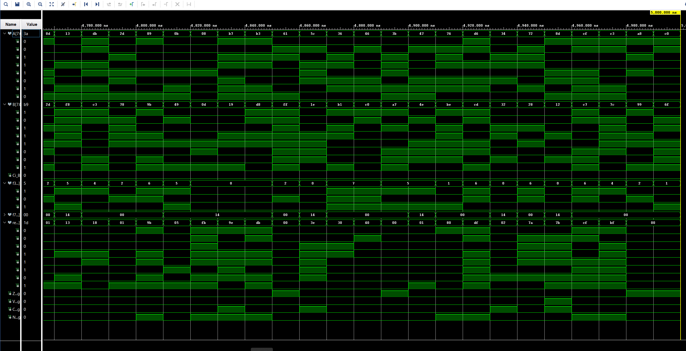
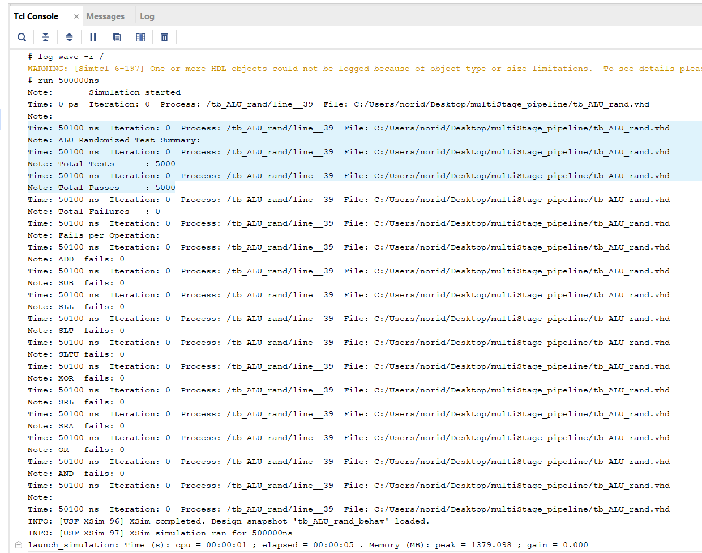
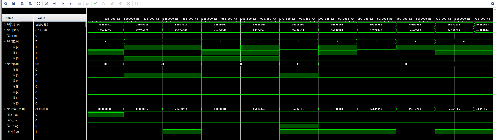
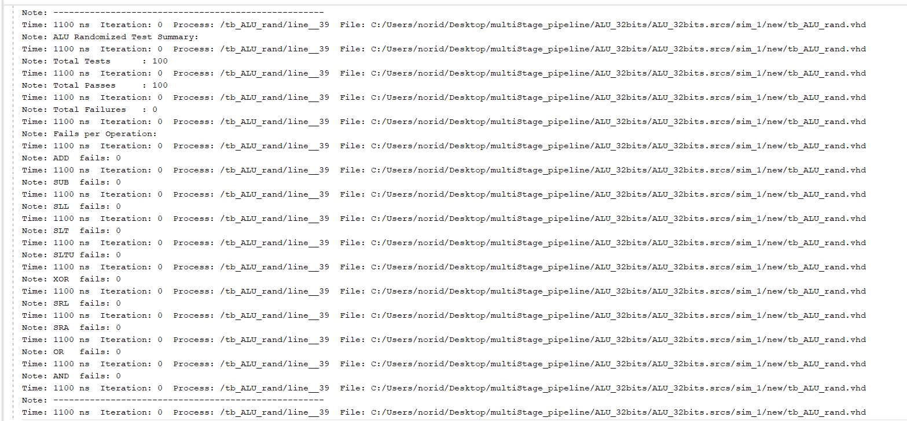
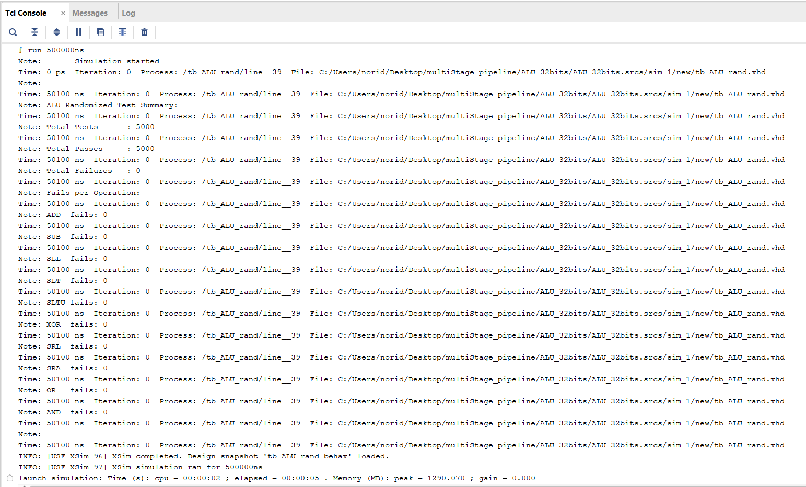

# ALU_with_testBenches_vhdl

## Overview
This project implements two Arithmetic Logic Units (ALUs) in VHDL:
- 8-bit ALU: Designed for learning and validating ALU logic.
- 32-bit ALU: Designed for integration into a 5-multistage pipelined RISC-V processor.
Each ALU supports multiple arithmetic and logic operations and includes self-checking testbenches, including randomized test generation to ensure robustness and edge-case coverage.

## Features
- 8-bit and 32-bit ALU designs
- Supported operations:
    - ADD, SUB
    - SLL, SRL, SRA
    - SLT, SLTU
    - AND, OR, XOR
- Fully self-checking testbenches:
    - Manual test vectors
    - Randomized golden-model comparisons
- Flag outputs: 
    - Z: Zero
    - N: Negative
    - C: Carry/Borrow
    - V: Overflow

## Project Structure
ALU_with_testBenches_vhdl/
├── ALU_8bits/
│   ├── images/
│   │   ├── ALU_TCL.png
│   │   ├── ALU_WAVE.png
│   ├── src/
│   │   ├── adder_8bits.vhd
│   │   ├── ALU_8bits.vhd
│   │   ├── FullAdder.vhd
│   │   ├── FullSubtractor.vhd
│   │   ├── sub_8bits.vhd
│   ├── test_benches/
│   │   ├── adder_subtractor/
│   │   │   ├── tb_adder_8bits.vhd
│   │   │   ├── tb_sub_8bits.vhd
│   │   ├── ALU_manually/
│   │   │   ├── tb_ALU.vhd
│   │   │   ├── tb_ALU_ext.vhd
│   │   │   ├── tb_ALU_v2.vhd
│   │   ├── ALU_random/
│   │       ├── tb_ALU_rand.vhd
│   │       ├── tb_ALU_random.vhd
├── ALU_32bits/
│   ├── images/
│   │   ├── passed100_test.png
│   │   ├── passed5000_test.png
│   │   ├── wave_32bits.png
│   ├── src/
│   │   ├── adder_32bits.vhd
│   │   ├── ALU_32bits.vhd
│   │   ├── FullAdder.vhd
│   │   ├── FullSubtractor.vhd
│   │   ├── sub_32bits.vhd
│   ├── test_bench/
│   │   ├── tb_ALU_rand.vhd
├── .gitignore
├── README.md

## Visual Output 
**For the ALU_8bits:**
### Waveform Results

### Tcl Console Output
**5000/5000** randomized test cases passed for the ALU_8bits:

**For the ALU_32bits:**
### Waveform Results

### Tcl Console Output
**100/100** randomized test cases passed for the ALU_32bits:

**5000/5000**  randomized test cases passed for the ALU_32bits:

## Testbench Strategy
Multiple testing approaches were used to validate the ALU:
- **Unit tests**: Fixed test vectors validate each operation.
- **Randomized tests**: uniform() function used to generate wide value coverage.
- **Self-checking logic**:  Compares actual vs expected results at runtime.
- **Per-operation counters**: Failures are tracked by operation to help isolate bugs and validate coverage.

## Key Learnings
- Developed confidence writing modular ALU logic in VHDL
- Handled signed/unsigned arithmetic explicitly in ALU
- Learned signal vs variable propagation in testbenches
- Designed randomized golden-model comparisons
- Scaled a working 8-bit model to a robust 32-bit implementation
- Strengthened debugging skills using waveform and Tcl output

## Installation/Usage

1. Launch **Vivado 2019** or newer.
2. Open the project or create a new one and add the files from either ALU_8bits or ALU_32bits.
3. Set any test bench of your choice as the top simulation unit.
4. Go to **Flow → Run Simulation → Run Behavioral Simulation** or 
    in the **project manager**, you can directly click the **run simulation -> Run Behavioral Simulation**.
    **Note:** For the randomized testing, the simulation runtime need to be adjusted based on the number of tests.
    In the project manager, click the **Simulation -> simulation settings** then, in the lower right,
    there are COMPILATION | ELABORATION | SIMULATION | and so on, click the **Simulation -> xsim.simulate.runtime** modify the value.
5. Open the **Waveform Viewer** to inspect signal transitions and flags
6. View the test results in the **Tcl Console**

## Contributing
This is a personal academic project. Suggestions, issues, and improvements are welcome through GitHub.

## License
MIT License

## Author
**Noridel Herron** (@MIZZOU)  
Senior in Computer Engineering  
noridel.herron@gmail.com

## Disclaimer
This project is developed solely for educational and personal learning purposes.  
It may contain unfinished or experimental features and is not intended for commercial or production use.
