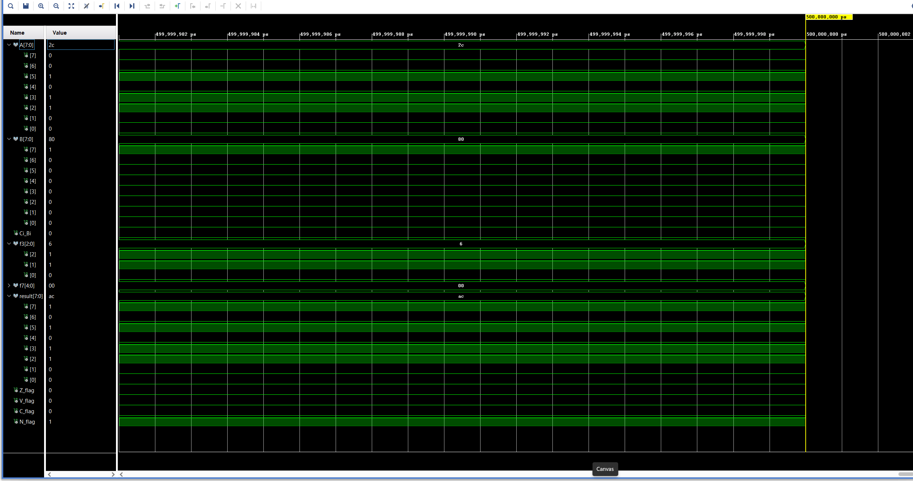

# ALU_with_testBenches_vhdl
A VHDL-based 8-bit ALU supporting RISC-V-style operations including arithmetic, logic, and shift instructions. Includes a randomized, self-checking testbench that verifies ALU correctness over 5000+ test cases using a golden model. Signals are validated per cycle, and pass/fail counters are maintained per operation. Tool: Vivado
---

## Supported Operations

| Operation | f3 code | f7 code     | Description                 |
|----------:|:--------|:------------|-----------------------------|
| ADD       | `000`   | `00000`     | Signed addition             |
| SUB       | `000`   | `10100`     | Signed subtraction          |
| SLL       | `001`   | `00000`     | Shift Logical Left          |
| SLT       | `010`   | `00000`     | Set if less than (signed)   |
| SLTU      | `011`   | `00000`     | Set if less than (unsigned) |
| XOR       | `100`   | `00000`     | Bitwise XOR                 |
| SRL       | `101`   | `00000`     | Shift Right Logical         |
| SRA       | `101`   | `10100`     | Shift Right Arithmetic      |
| OR        | `110`   | `00000`     | Bitwise OR                  |
| AND       | `111`   | `00000`     | Bitwise AND                 |

## Project Structure
ALU_with_testBenches_vhdl/
├── images/
│   ├── ALU_TCL.png
│   ├── ALU_WAVE.png
├── src/
│   ├── adder_8bits.vhd
│   ├── FullAdder.vhd
│   ├── sub_8bits.vhd
│   ├── FullSubtractor.vhd
│   ├── ALU.vhd
├── test_benches/
│   ├── adder_subtractor/
│   │   ├── tb_adder_8bits.vhd
│   │   ├── tb_sub_8bits.vhd
│   ├── ALU_manually/
│   │   ├── tb_ALU.vhd
│   │   ├── tb_ALU_ext.vhd
│   │   ├── tb_ALU_v2.vhd
│   ├── ALU_random/
│       ├── tb_ALU_rand.vhd
│       ├── tb_ALU_random.vhd
---

## Testbench Strategy
Multiple testing approaches were used to validate the ALU:
- **Unit testbenches**: Verified individual operations (e.g., ADD, SUB, SLL) with fixed input vectors and edge cases
- **Randomized testing**: Generated 5000+ randomized test cases across all operations using `uniform()` and golden reference models
- **Self-checking logic**: Expected results and flags are calculated internally and compared per test
- **Per-operation counters**: Failures are tracked by operation to help isolate bugs and validate coverage

## Key Learnings

- Gained experience handling both signed and unsigned arithmetic in VHDL
- Learned the importance of timing differences between `signal` and `variable`
- Built confidence in writing randomized self-checking testbenches
- Used `math_real.uniform()` to generate high-coverage input distributions
- Implemented per-operation pass/fail tracking for targeted debugging
- Discovered that certain edge case failures were caused by rounding errors in floating-point to integer conversion

## Simulation Results

**5000/5000** randomized test cases passed

### Tcl Console Output
This shows the final test summary from the randomized testbench:

### Waveform Example
Captured waveform for a successful OR operation showing `result`, control signals, and flags:

## How to Run

1. Launch **Vivado 2024.2**
2. Open the project or create a new one and add the files from the `src/` and `test_benches/` folder.
    For the test_benches, you can choose any of the test_bench code that have ALU to test the functionality of the ALU.
3. Set `tb_ALU_rand.vhd` as the top simulation unit
4. Go to **Flow → Run Simulation → Run Behavioral Simulation** or 
    in the **project manager, you can directly click the run simulation -> Run Behavioral Simulation**.
    **Note:** For the randomized testing, the simulation runtime need to be adjusted based on the number of tests.
    Click the in the project manager, click the **Simulation -> simulation settings** then, in the lower right,
    there are COMPILATION | ELABORATION | SIMULATION | and so on, click the **Simulation -> xsim.simulate.runtime** modify the value.
5. Open the **Waveform Viewer** to inspect signal transitions and flags
6. View the test results in the **Tcl Console**

### Tcl Console Output
----------------------------------------------------
ALU Randomized Test Summary:
Total Tests      : 5000
Total Passes     : 5000
Total Failures   : 0
Fails per Operation:
ADD  fails: 0
SUB  fails: 0
SLL  fails: 0
SLT  fails: 0
SLTU fails: 0
XOR  fails: 0
SRL  fails: 0
SRA  fails: 0
OR   fails: 0
AND  fails: 0
----------------------------------------------------

## Author

**Noridel Herron**  
Senior Computer Engineering Student  
**noridel.herron@gmail.com**